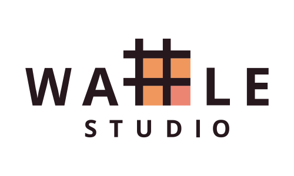

# 와플스튜디오 2022 세미나 레포지토리

- [세미나 수강 목록](./seminar-list.md)

    
2022 세미나는 다음 학기부터 개발 프로젝트에 참여할 수 있는 __20.5기 Programmers의 양성__ 및 __기존 부원의 실력 향상__ 을 목표로 합니다.
- React
  - JavaScript
- Django
  - Python
- Kotlin Spring MVC + JPA
  - Kotlin
- Android
  - Kotlin
- iOS
  - Swift

  

## OT

 

|  시간           | 장소 | 자료         | 참여 링크 | 영상 |
| --------------- | ---- | ----------- | --------- | ---- | 
| 2022년 8월 21일 | ZOOM | [PDF][OT_PDF] [PPT][OT_PPT]  | [ZOOM][OT_Zoom]   |      |

 

## 세미나

 

### 세미나 시간
| 세미나            | 요일   | 시간        |
| :--------------- | ----- | :---------- |
| Django   | 화요일 | 오후 7시      |
| Spring   | 화요일 | 오후 7시 30분 |
| IOS      | 화요일 | 오후 7시 30분 |
| Android  | 목요일 | 오후 8시      |
| React    | 토요일 | 오후 3시      |

 

### 세미나 진행상황
- 각 세미나의 일정과 과제, 이전 자료 등을 확인할 수 있습니다
- 세미나 별 첫 번째 세미나 일정이 업로드 되었습니다 (08/21)
 

React

 
  
| 회차     | 시간 | 장소 | 자료 | 과제 | 참여 링크 | 영상 |
| ------- |---- | ---- | ---- | ---- | ---- | ---- |
| seminar0 | 8월 27일 (토) 오후 3시 | [스프링 라운지](https://map.naver.com/v5/search/%EA%B4%80%EC%95%85%EA%B5%AC%20%EA%B4%80%EC%95%85%EB%A1%9C%2017%EA%B8%B8%209/address/14132147.65954141,4506312.0034357235,%EC%84%9C%EC%9A%B8%ED%8A%B9%EB%B3%84%EC%8B%9C%20%EA%B4%80%EC%95%85%EA%B5%AC%20%EA%B4%80%EC%95%85%EB%A1%9C17%EA%B8%B8%209,new?c=14132096.9201175,4506316.2959661,19,0,0,0,dh&isCorrectAnswer=true) 2층 |||||
| seminar1 |||||||
| seminar2 |||||||
| seminar3 |||||||
| seminar4 |||||||
| seminar5 |||||||

 

---

Django

 
  
[수업 일정 및 자료](./django/README.md#수업-일정-및-자료)

 

---

Kotlin Spring MVC + JPA

 

[수업 일정 및 자료](./spring/README.md#수업-일정-및-자료)

 

---

Android

 
  
| 회차     |                              시간 | 장소 | 자료 | 과제 | 참여 링크 | 영상 |
| -------- | --------------------------------: | ---- | ---- | ---- | ---- | ---- |
| seminar0 | 8월 25일 (목) 오후 8시 | [서울대입구 히든스페이스](https://map.naver.com/v5/entry/place/493556500?placePath=%2Fhome&c=14132109.2654490,4506235.8183284,15,0,0,0,dh) 3번방 | [자료](android/seminar0/seminar-0.md) ||||
| seminar1 |||||||
| seminar2 |||||||
| seminar3 |||||||
| seminar4 |||||||
| seminar5 |||||||

 

---

iOS

 
  
| 회차     | 시간 | 장소 | 자료 | 과제 | 참여 링크 | 영상 |
| ------- |---- | ---- | ---- | ---- | ---- | ---- |
| seminar0 | 9월 6일 (화) 오후 7시 30분 ||||||
| seminar1 |||||||
| seminar2 |||||||
| seminar3 |||||||
| seminar4 |||||||
| seminar5 |||||||

 

---

<!--
하단에는 각종 url들 작성 부탁드립니다 (인라인으로 다 쓰면 너무 더러워져서)
-->

[OT_PPT]: https://docs.google.com/presentation/d/1g9mBKmAVF0dIGJvDwVm-AdN5PHO_XU2d/edit?usp=sharing&ouid=104004442380463498825&rtpof=true&sd=true
[OT_PDF]: ./Rookies_OT_20.5_PDF.pdf
[OT_Zoom]: https://snu-ac-kr.zoom.us/j/7207172411?pwd=eVRiZ1ZiWGY4dVBCTnJZU05MaERFUT09

