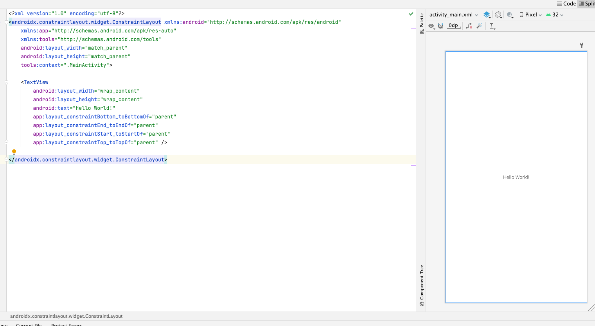
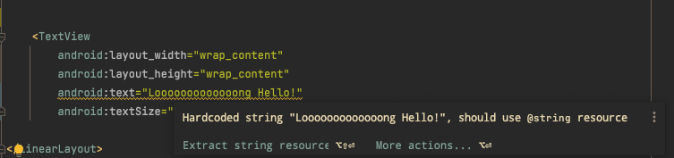

# Waffle Studio 2022 안드로이드 세미나
김상민 (@sanggggg)

---

# 할 일
- codelab 복습
- codelab quiz
- 과제 안내

---

# 복습 : Kotlin

1. Kotlin

```kotlin

fun main() {
  // 변수 선언
  //   val ${변수이름}: ${변수타입} = ${변수 값}
  //   var ${변수이름}: ${변수타입} = ${변수 값}
  val greetingMessage: String = greetingMessageFor("상민")
  println(greetingMessage)
}

// 함수 선언
// fun ${힘수이름}(${함수인자}): ${함수 반환 값}
fun greetingMessageFor(name: String): String {
  return "Hello, " + name + "!"
}
  
```

---

# Quiz - Kotlin

1. Kotlin 에서 함수를 선언하기 위한 단어는?
2. Kotlin 에서 불변 변수(?) 를 선언하기 위한 단어는?
3. Kotlin 에서 가변 변수(?) 를 선언하기 위한 단어는?


---

# Quiz - Kotlin

1. Kotlin 에서 함수를 선언하기 위한 단어는? `fun`
2. Kotlin 에서 불변 변수(?) 를 선언하기 위한 단어는? `val`
3. Kotlin 에서 가변 변수(?) 를 선언하기 위한 단어는? `var`

---

## Quiz - Kotlin

```kotlin
fun createMessage(name: String, location: String, age: Int) {
  println("My name is ${name}. I am from ${location}, and I am ${age} years old.")
}
```

함수를 올바르게 호출하는 방법은?

1. createMessage("Amy", "Australia", 20)

2. createMessage("Evan", England, 9)

3. createmessage("Tom", "Thailand", “40”)

4. createMessage(Heather, “Haiti”, 7)

---

# Quiz - Kotlin

```kotlin
fun createMessage(name: String, location: String, age: Int) {
  println("My name is ${name}. I am from ${location}, and I am ${age} years old.")
}
```

함수를 올바르게 호출하는 방법은?

1. createMessage("Amy", "Australia", 20)

---

# 복습 - Android Studio

- IDE
  - Integrated Development Environment
  - 메모장으로 코딩하기 가능...
  - 하지만 preview, debugging, layout inspect 등의 툴이 갖춰진 IDE 를 쓴다면 생산성이 유리하다.
- Emulator
  - 안드로이드 물리 기기가 없어도, 데스크탑에서 돌아가는 시뮬레이션용 기기
- SDK Version
  - 안드로이드 버전에 따라 사용할 수 있는 기능들이 다르다, 우리는 앱을 만들 때 어느 버전 까지 지원할 지 결정해야 한다.

---

# 복습 - 앱 UI 기초

- View
  - 안드로이드에서 그래픽 UI 하나하나는 View 라고 한다.
  - e.g.
    - TextView -> 텍스트를 보여주는 UI
    - ImageView -> 이미지를 보여주는 UI
- ViewGroup ...
  - 안에 담긴 UI 가 어떻게 배치 될 지 결정한다.
  - ConstraintLayout, LinearLayout 등 
- View attribute
  - View 의 다양한 요소를 결정
  - 자기자신의 모양을 결정하는 attribute
    - `text`, `textColor`, `width`, `height`, `shadow`
  - 어떤 위치에 보여질 지 결정하는 attribute
    - `constraint_topToTopOf`, `padding`, `margin`
    
---

# Quiz - 앱 UI 기초

만들어진 UI 는 어떤 파일에 저장되나요?


---

## Quiz - 앱 UI 기초

만들어진 UI 는 어떤 파일에 저장되나요?


xml 파일에 저장


---

# Quiz - 앱 UI 기초

Text Attribute 에서 왜 아래와 같은 경고가 나오나요?



---

## Quiz - 앱 UI 기초

Text Attribute 에서 왜 아래와 같은 경고가 나오나요?


번역이나 리소스 재사용에서 유리하기 때문에 해당 파일은 strings.xml 이라는 별도 파일로 관리하는 것을 권장합니다.
```xml
<resources>
    <string name="app_name">Tip Time</string>
    <string name="cost_of_service">Cost of Service</string>
    <string name="how_was_the_service">How was the service?</string>
    <string name="amazing_service">Amazing (20%)</string>
    <string name="good_service">Good (18%)</string>
    <string name="ok_service">Okay (15%)</string>
    <string name="round_up_tip">Round up tip?</string>
    <string name="calculate">Calculate</string>
    <string name="tip_amount">Tip Amount</string>
</resources>
```

---

# 복습 - Dice App

- if, when 을 사용한 분기 처리
- 터치 이벤트를 감지하려면 어떻게 해야 하나요?
  - `view.setOnClickListener { /* do something */ }`
- jpg, png 등 Image Asset 을 손쉽게 추가하는 방법 (Android Studio)
  - Resource Manager
- Image Asset 을 코드에서 사용하려면 어떻게 해야하나요?
  - `imageView.setImageResource(R.drawable.my_image)`
- 주석이 무엇인가요?
  - 코드나 상황의 맥락을 부연 설명하기 위한 결과물에 영향을 미치지 않는 텍스트
- 디버깅 어떻게 해야하나요?
  - `Log.d(TAG, "your debugging message")` 와 같이 직접 코드 내에서 값을 로깅하고
  - Android Studio 에서 제공하는 logcat 을 통해서 확인합니다.
- viewBinding
  - xml 에 있는 view 를 kotlin code 에 대응한 View instance 와 자동으로 대응시킵니다.

---

# Quiz - Dice App

클래스가 무엇인가요? 클래스와 인스턴스는 어떻게 다른가요?

```kotlin
class Cat {
  fun meow()
}

val myCat = Cat()
val strayCat = Cat()
myCat.meow()
strayCat.meow()
```

---

# Quiz - Dice App

클래스가 무엇인가요? 클래스와 인스턴스는 어떻게 다른가요?

class: 동일한 행동을 할 수 있는 무언가를 쉽게 만들기 위한 빵틀
instance: 빵틀로 직접 찍어낸 빵

```kotlin
class Cat {
  fun meow()
}

val myCat = Cat()
val strayCat = Cat()
myCat.meow()
strayCat.meow()
```

> Activity 도, View 도 클래스 입니다.

---

# 복습 - 팁 계산 앱

- Double -> 실수형 데이터 타입
- null
  - 값이 없음을 나타내는 값(?)
```kotlin
var a: Int? = null
println(a) // null
a = 4
println(a) // 4
a = null
println(a) // null 
```
- xml 과 Layout Editor 는 무엇이 다른가요?
  - Layout Editor 는 xml 을 코드가 아닌 GUI 로 수정할 수 있게 도와주는 **도구**
- 새로 배운 View
  - EditText (사용자의 텍스트 입력)
  - RadioGroup / RadioButton (선택지 중 하나를 선택하는 버튼)
  - Switch (on/off 여부를 토글하는 버튼)

---

# Quiz - 팁 계산 앱

class 상속이 무엇인가요?

---

## Quiz - 팁 계산 앱

class 상속이 무엇인가요?

-> 내가 만들고자 하는 기능이 기존 기능에서 추가적인 무언가, 라고 한다면 기존 기능을 상속하여 내 기능을 덧붙입니다.
-> 중복을 줄일 수 있고, 일관되는 호출 방식을 유지할 수 있습니다.
-> View 를 상속한 ImageView, TextView 등을 생각하면 편합니다.

---

# 복습 - Scrollable lists

- kotlin 의 list 자료구조: `List<T>`
  - MutableList 와 ImmutableList 가 따로 존재
  - 왜...? -> mutable 과 immutable 을 구분하므로 디버깅 시에 얻는 이점이나 사라지는 동시성 버그들이 많다
- list 를 순회하는 방법
  - 고전적인 `for`, `while`
  - `.forEach` 를 통한 순회

```kotlin
val myList = listOf(1, 2, 3, 4)

for (number in myList) {
  println(number)
}
myList.forEach { number -> println(number) }
```
  
---

# 복습 - Scrollable lists (RecyclerView)

- 반복되는 리스트를 View 로 만들기 -> 엄청 쉬운거 아닌가?

```kotlin
val linearLayout: LinearLayout

for (number in myList) {
  linearLayout.addView(TextView(text = "number ${number}"))
}
```

- 생기는 문제
  - myList 가 엄청 길면...?
  - myList 안에 있는 값이 바뀌면...?
  - 하나하나 값이 바뀔 때는 어떻게...?

---

# 복습 - Scrollable lists (RecyclerView)

- RecyclerView 를 통해 해결
- View 를 재사용(recycle) 하고, 특정 데이터와 연결지어 데이터가 변경되면 함께 변경되는 등의 유틸리티를 제공
- 그러면 RecyclerView 는 리스트를 넘겨받으면 어떻게 각 아이템을 View 로 바꿔줄지만 알려주면 된다 -> RecyclerViewAdapter & ViewHolder 의 역할

```kotlin
class ItemAdapter(
    private val context: Context,
    private val dataset: List<Affirmation>
) : RecyclerView.Adapter<ItemAdapter.ItemViewHolder>() {

    class ItemViewHolder(private val view: View) : RecyclerView.ViewHolder(view) {
        val textView: TextView = view.findViewById(R.id.item_title)
    }

    override fun onCreateViewHolder(parent: ViewGroup, viewType: Int): ItemViewHolder {
        val adapterLayout = LayoutInflater.from(parent.context)
            .inflate(R.layout.list_item, parent, false)

        return ItemViewHolder(adapterLayout)
    }

    override fun onBindViewHolder(holder: ItemViewHolder, position: Int) {
        val item = dataset[position]
        holder.textView.text = context.resources.getString(item.stringResourceId)
    }

    override fun getItemCount() = dataset.size
}
```


---

# Quiz - Scrollable List

수천개의 list item 을 다 view 로 만들면 왜 안되나요? 

---

# Quiz - Scrollable List

수천개의 list item 을 다 view 로 만들면 왜 안되나요? 

-> view 하나하나는 jvm 의 memory 위에 나타납니다. 따라서 view 가 어엄청 많아지면 그만큼 메모리도 부족해 지기 때문입니다.

---

# Quiz - Scrollable List

RecyclerView 는 왜 Adapter 를 필요로 하나요?

---

# Quiz - Scrollable List

RecyclerView 는 왜 Adapter 를 필요로 하나요?

-> 새로운 list item 이 생길 때 그에 맞는 View(ViewHolder) 를 만들어 내는 방법과
-> list item 안에서 변경이 일어날 때 그 변경에 따라 UI 를 바꾸는 방법등을 알아야하고
-> Adapter 가 이런 구현을 담당하기 떄문입니다.

---

# 과제

- [android-basics-kotlin unit 2](https://developer.android.com/courses/android-basics-kotlin/unit-2?hl=ko)
- [android-basics-kotlin unit 3](https://developer.android.com/courses/android-basics-kotlin/unit-3?hl=ko)
- [git interactive tutorial](https://learngitbranching.js.org/?locale=ko)
- [Project: TicTacToe 앱 만들기](https://github.com/wafflestudio/seminar-2022-android-assignment/blob/main/assignment-0/README.md)
  - 스켈레톤 코드 & README.md 제공
  - github를 통한 제출을 해야 하기 때문에 슬슬 깃에 대해 이해해야 합니다.
> **안드로이드 세미나 수료를 위해서는 앞으로 제공될 Project 과제 및, android-basics-kotlin codelab 이 100% 완료되어야 합니다**


