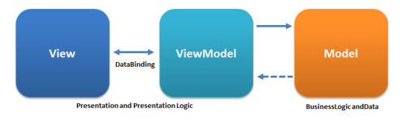

# Waffle Studio 2022 안드로이드 세미나
김상민 (@sanggggg)

---

# 할 일
- git araboza
- codelab 복습
- codelab quiz

---

# git 을 쓰는 이유
- 기능A 를 개발했다
- 다음날 새로운 기능B 를 개발했다
- 갑자기 기능B 는 나두고 기능A를 롤백해 달라고 한다. 그런데 어떤 코드를 제거해야하는지 까먹었다...

---

# git 을 쓰는 이유
- 개발하다가 뭔가 이해 불가능한 코드가 있다...
- 이걸 누가짠거지? 모르겠으니 회사의 모든 사람들에게 돌아다니면서 `코드 주인이세요?` 물어본다.
- 코드 주인이 맥락을 설명해줘서 납득하고 마저 개발을 진행했다.

---

# git 을 쓰는 이유
- 친구와 협업을 한다.
- 친구는 A를 개발하고 나는 B 를 개발해서 합칠 생각이다.
- 둘다 코드를 짜 놓고 합치려고 하는데 서로 같은 코드를 건드리고 있다.
- 손으로 한땀한땀 친구랑 같이 이건 내 코드를 넣어야 하니 저건 니 코드를 넣어야 하니 하고 있다. 

---

# git 이 하는 일
- 파일을 변경한 이력을 추적하기 위한 software (VCS)
- 변경할 때 마다 기록을 남기기 (최종, 최최종, 최최최종) 정도 였지만
- 더 나아가서 협업에서도 잘 적용할 수 있어야 한다.

- 내가 개발한 기록을 남긴다.
- 어떤 코드를 어떤 이유로 추가/제거/변경했는지 기록할 수 있다.
- 다른사람의 작업과 내 작업이 쉽게 합쳐지지 않을 경우 merge/rebase 할 수 있다.

---

# 무언가 보여 드리겠습니다: git show

---

# 복습: kotlin List vs Set vs Map
- 일반적으로 유용하게 사용되는 3개의 자료구조
- 각각
  - 중복이 발생할 수 있는 집합 (List)
  - 중복이 발생하지 못하는 집합 (Set)
  - key-value 쌍으로 이루어진 List (Map)
- 이런 순회 가능한 자료구조들을 쉽게 다루는 방법 -> lambda

```kotlin
val myList = listOf<Int>(1, 1, 1) // [1, 1, 1]
val mySet = setOf<Int>(1, 1, 1) // (1)
val myMap = mapOf<String, Int>("hello" to 1, "hi" to 2) // { "hello": 1, "hi": 2 }
```

---

# 복습: Lambda
- lambda -> 익명함수, 하나의 자료형
- 익명** -> 내가 명시적인 참조 이름을 정하지 않는 것들.
- 하나의 자료형 이므로 또 다른 함수의 인자로 넘길 수 있다.

```kotlin
// 함수
fun hello() {
  println("Hello")
}

// 익명함수
{
  println("Hello")
}

// 익명함수를 할당해서 사용
val sayHello = {
  println("Hello")
}
```

---

# 복습: forEach, map, filter 
- 이런 lambda 를 활용해 순환 가능한 자료구조를 쉽게 다룰 수 있다.
```kotlin
fun List<T>.forEach(fn: (T) -> Unit) {
  for (item in this) {
    fn(item)
  }
}

names.forEach { println("HelloWorld!") }
```

---

# 복습: UI Navigation
- 다양한 UI 페이지를 만들고, 페이지 간의 전환을 만드는 방법 -> Navigation
- UI 의 맥락을 페이지에 따라서 나누는 것이 일반적이기 때문
- 송금페이지 / 가계부 페이지 처럼...

---

# 복습: Navigation with Activity
- Activity 하나가 한 UI 페이지가 될 수 있다.
- 그렇다면 새로운 Activity 를 띄우는 요청을 할 수 있어야 한다 -> `Intent`

- `Intent` 는 android framework 에 request 를 보내는 일반화된 방법
  - Activity 뿐 아닌 Service, BroadcastReceiver 를 연결하기 위해서도 사용한다.
- `AndroidManifest.xml` 에서 수용 가능한 request 를 적어두기도 한다.

---

# 복습: Activity 다시 뜯어보기

- Activity 는 Intent 를 통해 생성이 요청되면 각 단계마다 해야할 일을 Lifecycle method 형태로 구현할 수 있다
- 익히 사용한 onCreate, onDestroy 가 이런 친구들


---

# 복습: Activity 뜯어보기

- 만악의 근원 - Configuration Change!
  - 기기회전
  - 폰트 사이즈 변경 등
  - 이럴 때 마다 onDestroy 가 호출된다 (액티비티가 내려왔다가 다시 올라온다...)
- 이런 상황에서 값을 유지하기 위한 방법 -> Bundle
- 왜 이렇게 귀찮게...?
  - Activity 는 하나의 OS Process 이고, 가로변경에서는 어쩔 수 없이 이 OS Process 를 다 죽여야 한다..
  - 그렇기에 이 정보를 유지시킬 수 있는 방법이 필요하다.

---
# Quiz

### `oneWordCities[1]` 의 결과는?

```kotlin
val cities = listOf("Jeddah", "Bengaluru", "Shenzhen", "Abu Dhabi", "Mountain View", "Tripoli", "Bengaluru", "Lima", "Mandalay", "Tripoli")
val oneWordCities = cities.toSet().toList().filter { !it.contains(" ")}.sorted()
```

1. Tripoli

2. Abu Dhabi

3. Jeddah

4. Bengaluru

---

# Quiz

### 대화상자가 Activity 의 일부를 가리게 되는 순간, Activity 의 어떤 Lifecycle Method 가 호출되는가?

1. onPause() because the activity is still displayed, but no longer has focus.

2. onStop() because the activity does not need to respond to user input while the dialog is onscreen.

3. onResume() because the activity needed to respond to user input to display the dialog.

4. onDestroy() because the activity does not need to exist so long as it doesn’t have focus.

---

# 복습 - Fragment

- Activity 또한 Page 를 구성하는 좋은 방법이지만, 꼭 Activity 를 기준으로 Page 를 구현할 필요는 없다
  - Activity 안에서도 내 마음대로 UI 를 바꿀 수 있지 않은가? 그냥 전체를 덮는 View 를 만들면 되는 것 아닌가?
  - 비슷한 맥락으로 Fragment 로만 구성하는 Single Activity Application 이나
  - Fragment 도 사용하지 않는 Single Activity Application 들도 존재한다.
- 비슷한 맥락에서 나온 Fragment
  - Activity 보다 작은 scope 로 존재하며 별도의 lifecycle 함수를 가진다.
- onViewCreated vs onCreateView

---

# Quiz

## Fragment 사용시의 이점은?

1. Navigation between fragments allows for more sophisticated user interface patterns, such as tab bars.

2. Using multiple fragments within an activity allows for an adaptive layout across multiple screen sizes.

3. The same fragments can be reused across multiple activities.

4. All of the above

---

# 복습 - ViewModel
ViewModel 은 두 가지 역할을 병행하고 있다.
- 1. Configuration Change 에 대해서 사라지지 않고 데이터를 유지하기
- 2. Activity, Fragment 와 같은 UI Controller 에서 데이터를 핸들링하는 로직 분리하기.
- 일반적인 MVVM 


---

# 복습 - ViewModel

- 아래와 같이 Fragment 내에서 접근 가능하다
- 하지만 단순 생성자로 접근하는 형태 x (그러면 Fragment 랑 생명주기가 같아지니까)
- 별도의 getter 가 내부적으로 구현되어 있는 형태이다.

```kotlin
private val viewModel: GameViewModel by viewModels()
```

> 속성 위임 (read & write 도 interface 다!)

---

# 복습 - Observable Pattern

- MVVM 다이어그램 상에서 중요한 부분은
  - View (UI) 는 ViewModel 을 의존하지만
  - ViewModel 은 View (UI) 를 의존하지 않는다!
- 이를 위해서는 ViewModel 은 데이터의 Stream 을 뱉는 형태여야 한다.
- 이를 위해 사용되는 Observable Pattern

```kotlin
// viewModel 의 코드
class HumanViewModel: ViewModel() {
  // ...
  val humanNameObservable = LiveData<String>()
  // ...
}

// View 의 코드
class HumanView: View {
  // ...
    viewModel.humanNameObservable.observe { name ->
      nameView.text = name
    }
  // ..
}
```

---

## 과제

- [android-basics-kotlin unit 4](https://developer.android.com/courses/android-basics-kotlin/unit-4?hl=ko)
