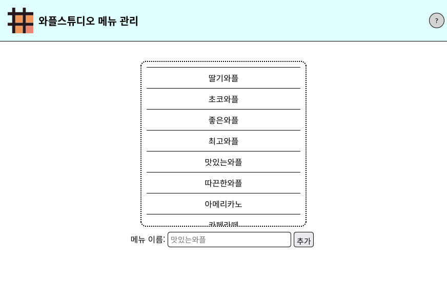

# 2022 React 세미나 과제 0

과제 0는 HTML + CSS + JS로 간단한 와플 메뉴 관리 페이지 만들기입니다.

## 과제 목표

* HTML의 구조에 대해서 이해한다.
* HTML, CSS, JS의 역할을 이해하고, 사용법에 익숙해진다.

## Spec

1. 첫 과제는 간단하게 시작하겠습니다.
    - 메뉴 내용은 **이름** 만 있고, 기능 역시 **추가** 기능만 있습니다.
    - 아래 스크린샷을 기준으로 만들어주세요.

2. 채점할 스펙은 다음과 같습니다.
    - 기능
        - 추가 버튼으로 새 메뉴가 추가된다.
        - 엔터키로도 새 메뉴를 추가할 수 있다.
        - 입력창 왼쪽의 '메뉴 이름' 텍스트를 클릭하면 입력창으로 포커스가 이동한다.
        - 이름을 입력하지 않거나 10글자가 넘는 메뉴를 추가할 시 alert가 뜬다.
        - 헤더 좌측의 제목 또는 이미지 클릭 시 https://wafflestudio.com 으로 이동한다.
        - 헤더 우측의 도움말 버튼 클릭 시 사이트의 대략적인 사용법을 알려주는 alert가 뜬다.
    - 스타일
        - 각 요소의 크기와 위치가 적절하다.
          - 창 크기 1000x600 ~ 1800x900 이내일 때 문제없이 사용할 수 있어야 합니다.
        - 메뉴 사이사이에 실선이 들어간다.
        - 메뉴가 너무 많아 칸 높이 안에 들어가지 않으면 스크롤이 생긴다.
        - 기타 디자인에 오류가 없다.
3. 아래 항목도, 엄격하게는 아니어도 어느 정도 채점 결과에 반영합니다.
    1. 코드 리드미 및 주석이 적절하다.
    2. 변수 및 함수명이 적절하다.

    - 물론 첫 과제이니만큼 이걸로 당락을 결정하기보단, 다음 과제부터 어떤 부분을 더 신경써달라고 피드백을 드리겠습니다.

## 주의사항

1. 디자인은 완벽하게 동일할 필요는 없으나, 최대한 비슷하게 해 주시기 바랍니다.
    - 각 요소의 위치, 크기, 모양은 가능한 비슷하게 맞춰주세요.
    - 폰트와 색상 등은 마음대로 꾸며도 괜찮습니다.
2. **개발자 도구**를 사용하시면 과제하는 데 큰 도움이 될 것입니다.

## 제출 방법

* [해당 문서](./submission-guide.md) 참조